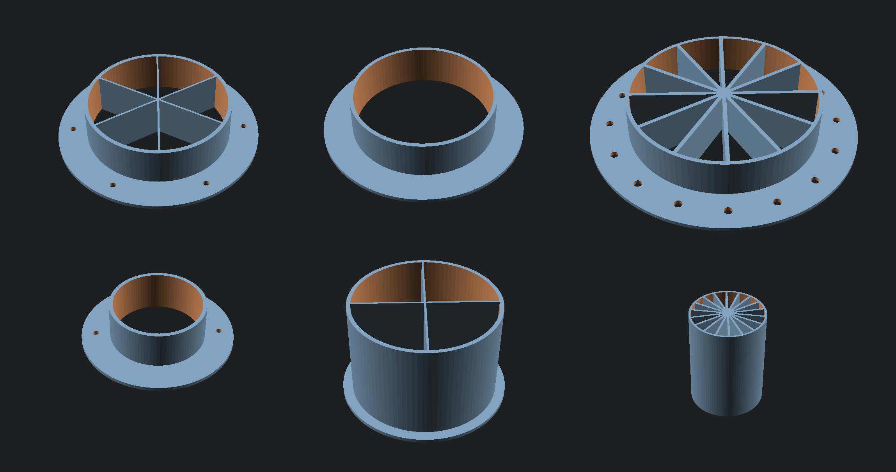
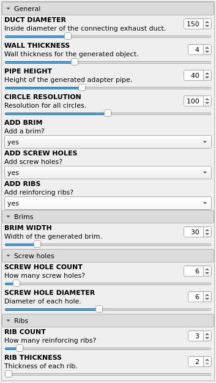

# exhaust-duct-wall-adapter

Parametric exhaust duct wall adapter.

Based on: https://www.thingiverse.com/thing:4690733 ([Jolocity](https://www.thingiverse.com/jolocity/designs))

## Motivation
I needed an adapter for a CO2 laser cutter exhaust system. The cheapest one I could find was pricier than I wanted to pay, so I decided to find a ready-made one and print it.

The closest thing I could find was [Jolocity](https://www.thingiverse.com/jolocity/designs)'s design, but I decided to tweak it a little more (I love to play with [OpenSCAD](https://openscad.org/))

## Changes in this version
* Added screw holes (optional).
* Added reinforcing ribs (optional).
* Parameters changed to fit a duct adapter.
* Added comments and parameter ranges for customizers.

## Examples

## Settings

